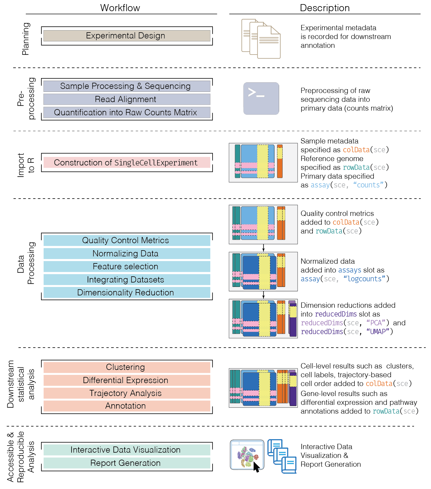

```{r setup, include=FALSE, message=FALSE}
knitr::opts_chunk$set(echo = TRUE, message = FALSE, warning = FALSE)
library(scater)
```

# Overview

## Key resources

- Workshop material: [pkgdown website](https://stephaniehicks.com/jhuquantneuro2022)
- Code: [GitHub](https://github.com/stephaniehicks/jhuquantneuro2022)


# Part 1

## Learning objectives 

1. Understand how count matrices are created from single-cell experimental platforms and protocols
2. Recognize which basic principles and concepts were transferred from bulk to single-cell data analyses
3. Understand the key differences between bulk and single-cell data 
4. Define what is a "Unique Molecular Identifier"
5. Define multiplexing (and demultiplexing)
6. Overview of basics in single-cell data analyses including quality control, normalization, feature selection, dimensionality reduction, and clustering

## Materials 

We will go through the slides available here: 

- https://docs.google.com/presentation/d/1XHfN-5NCXtu1P4reotrckGplPXJBTlQraFpd8ViPf1g/edit?usp=sharing


# Part 2

## Learning objectives 

1. Be able to create a single-cell count matrix and read it into R
2. Recognize and define the `SingleCellExperiment` S4 class in R/Bioconductor to store single-cell data

## Overview 

NGS data from scRNA-seq experiments must be converted into a matrix of expression values. 

This is **usually a count matrix** containing the number of reads (or UMIs) mapped to each gene (row) in each cell (column).
Once this quantification is complete, we can proceed with our downstream statistical analyses in R.

Constructing a count matrix from raw scRNA-seq data requires some thought as the term “single-cell RNA-seq” encompasses a variety of different experimental protocols. 
This includes 

- **droplet-based protocols** like 10X Genomics, inDrop and Drop-seq
- **plate-based protocols** with UMIs like CEL-seq(2) and MARS-seq 
- **plate-based protocols** with reads (mostly Smart-seq2)
- others like sciRNA-seq, etc

Each approach requires a different processing pipeline to deal with cell demultiplexing and UMI deduplication (if applicable). 
Here, we will briefly describe some of the methods used to generate a count matrix and read it into R.

## Creating a count matrix

As mentioned above, the exact procedure for quantifying expression depends on the technology involved:

- For **10X Genomics data**, the `Cellranger` software suite (Zheng et al. 2017) provides a custom pipeline to obtain a count matrix. This uses STAR to align reads to the reference genome and then counts the number of unique UMIs mapped to each gene.
- Alternatively, pseudo-alignment methods such as [`alevin`](https://doi.org/10.1186/s13059-019-1670-y) (Srivastava et al. 2019) can be used to obtain a count matrix from the same data. This avoids the need for explicit alignment, which reduces the compute time and memory usage.
- For other **highly multiplexed protocols**, the [`scPipe`]( http://bioconductor.org/packages/scPipe/) package provides a more general pipeline for processing scRNA-seq data. This uses the Rsubread aligner to align reads and then counts reads or UMIs per gene.
- For **CEL-seq or CEL-seq2 data**, the `scruff` package provides a dedicated pipeline for quantification.
- For **read-based protocols**, we can generally re-use the same pipelines for processing bulk RNA-seq data (e.g. Subread, RSEM, salmon) 
- For **any data involving spike-in transcripts**, the spike-in sequences should be included as part of the reference genome during alignment and quantification.

In all cases, the **identity of the genes** in the count matrix should be **defined with standard identifiers from Ensembl or Entrez**. 
These provide an unambiguous mapping between each row of the matrix and the corresponding gene.

In contrast, **a single gene symbol** may be used by multiple loci, or the mapping between symbols and genes **may change over time**, e.g., if the gene is renamed. 

This makes it difficult to re-use the count matrix as we cannot be confident in the meaning of the symbols. 

(Of course, **identifiers can be easily converted to gene symbols** later on in the analysis. 
This is the recommended approach as it allows us to document how the conversion was performed and to backtrack to the stable identifiers if the symbols are ambiguous.)

## `SingleCellExperiment` Class

One of the **main strengths** of the Bioconductor project lies in the use of **a common data infrastructure** that powers interoperability across packages. 

Users should be able to analyze their data using functions from different Bioconductor packages without the need to convert between formats. 

To this end, the `SingleCellExperiment` class (from the `SingleCellExperiment` package) serves as the common currency for data exchange across 70+ single-cell-related Bioconductor packages. 

This class implements a data structure that stores all aspects of our single-cell data - gene-by-cell expression data, per-cell metadata and per-gene annotation - and manipulate them in a synchronized manner.

```{r, out.width = "780px", show=TRUE, fig.align="center", fig.caption = "Overview of the structure of the `SingleCellExperiment` class. Each row of the assays corresponds to a row of the `rowData` (pink shading), while each column of the assays corresponds to a column of the `colData` and `reducedDims` (yellow shading).", echo=FALSE}
knitr::include_graphics("figures/SingleCellExperiment.png")
```

[Amezquita et al. 2019 (https://doi.org/10.1101/590562)]


- Each piece of (meta)data in the `SingleCellExperiment` is **represented by a separate "slot"**.

(This terminology comes from the S4 class system, but that’s not important right now). 

If we imagine the `SingleCellExperiment` object to be a cargo ship, the **slots can be thought of as individual cargo boxes with different contents**, e.g., certain slots expect numeric matrices whereas others may expect data frames. 

If you want to know more about the available slots, their expected formats, and how we can interact with them, check out this [chapter](https://bioconductor.org/books/3.15/OSCA.intro/the-singlecellexperiment-class.html). 


### `SingleCellExperiment` Example

Let's show you what a `SingleCellExperiment` (or `sce` for short) looks like. 

```{r, message=FALSE, echo=FALSE}
library(scRNAseq)
sce <- ZeiselBrainData()
```

```{r}
sce
```

This `SingleCellExperiment` object has `r nrow(sce)` genes and `r ncol(sce)` cells.

We can pull out the counts matrix with the `counts()` function and the corresponding `rowData()` and `colData()`: 

```{r}
counts(sce)[1:5, 1:5]
rowData(sce)
colData(sce)
```


# Part 3

## Learning objectives 

1. Be able to describe a standard workflow for analyzing single-cell data
2. Be able to run code for a standard workflow starting from loading a `SingleCellExperiment` in R and identifying clusters.


## Overview 

Here, we provide an overview of the framework of a typical scRNA-seq analysis workflow:  

```{r, out.width = "780px", show=TRUE, fig.align="center", fig.caption = "Schematic of a typical scRNA-seq analysis workflow. Each stage (separated by dashed lines) consists of a number of specific steps, many of which operate on and modify a SingleCellExperiment instance.", echo=FALSE}

```


In the simplest case, the workflow has the following form:

1. We compute **quality control metrics** to remove low-quality cells that would interfere with downstream analyses. These cells may have been damaged during processing or may not have been fully captured by the sequencing protocol. Common metrics includes the total counts per cell, the proportion of spike-in or mitochondrial reads and the number of detected features.
2. We convert the counts into **normalized expression values** to eliminate cell-specific biases (e.g., in capture efficiency). This allows us to perform explicit comparisons across cells in downstream steps like clustering. We also apply a transformation, typically log, to adjust for the mean-variance relationship.
3. We perform **feature selection to pick a subset of interesting features** for downstream analysis. This is done by modelling the variance across cells for each gene and retaining genes that are highly variable. The aim is to reduce computational overhead and noise from uninteresting genes.
4. We apply **dimensionality reduction to compact the data** and further reduce noise. Principal components analysis is typically used to obtain an initial low-rank representation for more computational work, followed by more aggressive methods like $t$-stochastic neighbor embedding for visualization purposes.
5. We **cluster cells into groups** according to similarities in their (normalized) expression profiles. This aims to obtain groupings that serve as empirical proxies for distinct biological states. We typically interpret these groupings by identifying differentially expressed marker genes between clusters.

## Quick start (simple)

Here, we use the a droplet-based retina dataset from Macosko et al. (2015), provided in the `scRNAseq` package. 
This starts from a count matrix and finishes with clusters in preparation for biological interpretation. 
We also demonstrate how to identify differentially expressed genes between the clusters. 

```{r}
library(scRNAseq)
sce <- MacoskoRetinaData()

# Quality control (using mitochondrial genes).
library(scater)
is.mito <- grepl("^MT-", rownames(sce))
qcstats <- perCellQCMetrics(sce, subsets=list(Mito=is.mito))
filtered <- quickPerCellQC(qcstats, percent_subsets="subsets_Mito_percent")
sce <- sce[, !filtered$discard]

# Normalization.
sce <- logNormCounts(sce)

# Feature selection.
library(scran)
dec <- modelGeneVar(sce)
hvg <- getTopHVGs(dec, prop=0.1)

# PCA.
library(scater)
set.seed(1234)
sce <- runPCA(sce, ncomponents=25, subset_row=hvg)

# Clustering.
library(bluster)
colLabels(sce) <- clusterCells(sce, use.dimred='PCA',
    BLUSPARAM=NNGraphParam(cluster.fun="louvain"))    
```

```{r, fig.cap="UMAP plot of the retina dataset, where each point is a cell and is colored by the assigned cluster identity."}
# Visualization.
sce <- runUMAP(sce, dimred = 'PCA')
plotUMAP(sce, colour_by="label")
```

```{r}
# Marker detection (between pairs of groups)
markers <- findMarkers(sce, test.type="wilcox", direction="up", lfc=1)
length(markers)
markers[[1]]
```

## Quick start (multiple batches)

If you could like to see Quick Start for scRNA-seq data with multiple batches, check out this workflow: 

- https://bioconductor.org/books/3.15/OSCA.intro/analysis-overview.html#quick-start-multiple-batches


# Session Info

```{r}
sessionInfo()
```

